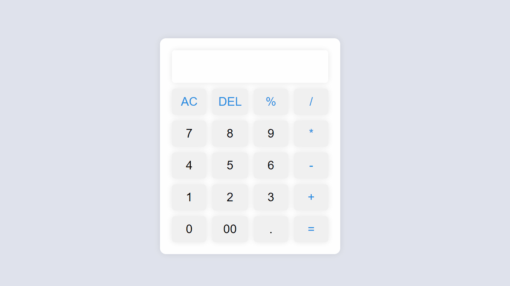

<p align="center">

# Smart Calc



</p>

## Sobre o Projeto 📝

O SmartCalc é uma calculadora projetada para fornecer uma experiência de cálculo fácil e eficiente. Desenvolvida com JavaScript puro, juntamente com HTML e CSS para a interface do usuário, esta calculadora oferece as funcionalidades essenciais para realizar operações matemáticas básicas e intermediárias.

### Funcionalidades 🚀

- Operações Básicas: Realize operações matemáticas básicas, como adição, subtração, multiplicação e divisão é até porcentagem.

- Interface Responsiva: Desfrute de uma interface amigável e responsiva para uma experiência de usuário confortável.

## Tecnologias Utilizadas ⚒️

[](https://skillicons.dev)

## Instalação

1. Clone este repositório:

```sh
git clone https://github.com/Fransuelton/smart-calc.git
```

2. Navegue até o diretório do projeto:

```sh
cd smart-calc
```

3. Instale as dependências:

```sh
npm install
```

## Testes 🧪

O SmartCalc inclui testes automatizados que foram implementados utilizando a ferramenta Vitest, os testes são para garantir o seu correto funcionamento e a integridade do código. Para executar os testes, utilize o seguinte comando:

```sh
npm run test
```

## Contribuição 🤝

Contribuições são bem-vindas! Sinta-se à vontade para propor melhorias, correções de bugs ou adicionar novas funcionalidades ao SmartCalc. Basta abrir uma [issue](https://github.com/Fransuelton/smart-calc/issues) ou enviar um [pull request](https://github.com/Fransuelton/smart-calc/pulls).

## Licença 📜

Este projeto está licenciado sob a licença MIT.
